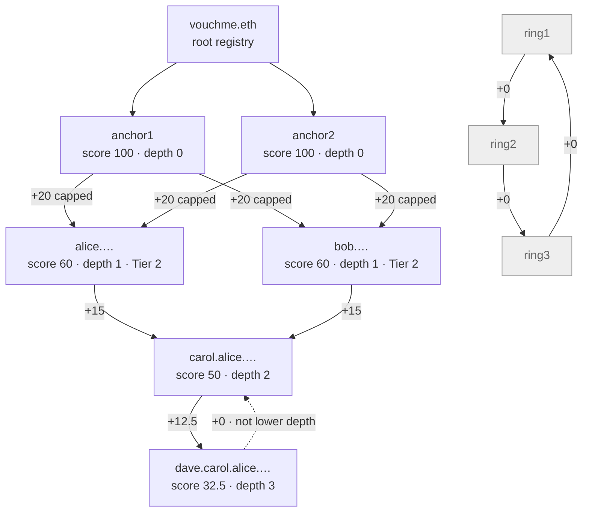

# VouchMe

**Proof of human is a floor. VouchMe is the ladder.**

World ID proves you are *a* human. It cannot prove you are not *already here under another name*.
VouchMe closes that gap with the one thing nobody can fake at scale: the people who already know you.

Live: **[vouchme.vercel.app](https://vouchme.vercel.app)** · landing **[/landing](https://vouchme.vercel.app/landing)** · deck **[/pitch](https://vouchme.vercel.app/pitch)**
Worked example: **[fiar-vouchm.vercel.app](https://fiar-vouchm.vercel.app)** · **[lend-vouchm.vercel.app](https://lend-vouchm.vercel.app)**

---

## The gap this exists to close

| | |
|---|---|
| **World ID nullifier** | Per app, per action, one person produces exactly one nullifier. Airtight — and it binds the wrong thing. It gives you **one account per World ID**. |
| **Selfie Check** | Gives you **one World ID per human — weakly.** World's own docs call it *"some Sybil resistance … weaker than higher-assurance methods like iris scanning."* |
| **The gap** | Hold `n` Selfie Checks and you hold `n` World IDs, therefore `n` nullifiers, therefore `n` accounts. The nullifier constraint is perfect and irrelevant. |

Closing it with hardware (Orb) works but does not reach the people who show up on day one.
With documents, it shuts out everyone without papers. With a stake, it makes being human a
question of money.

What is left is everywhere, free, and already yours: **people who know you.**

---

## Two rules do all the work

**1. Attenuation — you can relay trust, you cannot mint it.**
A vouch is worth **25% of the voucher's own score, capped at 20 points**. Above a score of 80 the
cap binds, so an anchor's vouch and a strong member's vouch are worth exactly the same 20. Being
trusted does not make you a bigger tap.

**2. Direction — a score counts only vouches from strictly lower depth**, i.e. only from accounts
strictly closer to an anchor than you are.

Rule 2 is the entire anti-collusion mechanism. A clique that vouches for itself contains no member
at lower depth than itself, so it contributes exactly zero to itself and stays at the floor forever.

> **The anti-collusion rule and the computation order are the same rule.**
> There is no separate collusion detector to tune, evade, or false-positive.

Constants: floor **20** · Tier 1 **55** · Tier 2 **140** · Orb anchor fixed at **100**, depth 0,
ignoring every inbound vouch · vouches expire at **90 days** unless re-affirmed · revocation is free,
instant, and effective on the next read.

---

## The ENS tree *is* the trust graph

This is the part worth reading closely.

A vouch is not a database row that points at a name. **A vouch is the name.** When Alice vouches for
Carol, Carol's subname is minted *inside Alice's own registry*, so the resulting name is
`carol.alice.vouchme.eth`. Depth in the trust graph is the label count in the name, and it is
resolved live from on-chain ENS state on every lookup — never stored, never hardcoded.

ENSv1 has one flat registry. **ENSv2 gives every name with subnames its own registry contract**,
which is what makes this possible: each member *is* a registry, and vouching is calling
`register(label, vouchee)` on your own.



The same thing as a name tree, which is what a resolver actually walks:

```
vouchme.eth                              root registry
├── anchor1.vouchme.eth                  100  depth 0   Orb-verified, fixed, never climbs
├── anchor2.vouchme.eth                  100  depth 0
├── alice.vouchme.eth                     60  depth 1   20 + 20 + 20
│   └── carol.alice.vouchme.eth           50  depth 2   20 + 15 + 15
│       ├── dave.carol.alice.vouchme.eth  32.5 depth 3   20 + 12.5
│       └── erin.carol.alice.vouchme.eth  32.5 depth 3
├── bob.vouchme.eth                       60  depth 1
│   └── grace.bob.vouchme.eth             35  depth 2
│
└── (unreachable — no path to any anchor)
    ring1 ⇄ ring2 ⇄ ring3 ⇄ ring4 ⇄ ring5 ⇄ ring6
    six accounts, thirty real and active vouches, every one worth +0
    all six sit at 20 forever
```

**Read the ring block again.** Nothing there is switched off, flagged, or detected. Every vouch is
real and active. No member of the ring is closer to an anchor than any other, so no term enters any
sum. Adding accounts adds edges that were already worth zero; buying accounts buys more of the same
nothing. There is no threshold to hide under and no model to fool, because there is neither.

### Resolution is a walk, not a lookup

Resolving `carol.alice.vouchme.eth` is repeated `getSubregistry()` hops — the same breadth-first walk
the scoring engine does off chain, done on chain by the name system:

```
vouchme.eth registry → getSubregistry("alice") → alice's registry
                     → getSubregistry("carol") → carol's registry → resolver → address + text records
```

Text records are computed **at resolution time** from live graph state, so nothing goes stale:

| Record | Value |
|---|---|
| `vouchme.score` | 50 |
| `vouchme.tier` | 1 |
| `vouchme.depth` | 2 |
| `vouchme.subgraph` | the deployment ID the number was read from |

That last record is the point: any third party can recompute the score we display, from public data,
and check it against the same block we read.

**Subnames as access tokens.** Holding a subname nested under a trusted parent *is* the permission
record. There is no separate ACL — tier access falls out of where your name sits in the tree.

**Deployed, on Ethereum Sepolia:** 17 member registries, one contract per member.
Parent registry [`0xb8C3d3AD86b0b66CE5401c81e9c4a037DF69eF33`](https://sepolia.etherscan.io/address/0xb8C3d3AD86b0b66CE5401c81e9c4a037DF69eF33) ·
resolver `0x211D6CC339C7C6E4B4448c04cD034E363d9994d3` ·
full map in [`deployments/ens-members-sepolia.json`](deployments/ens-members-sepolia.json).
Registries deploy at a deterministic address derived from the label alone, so anyone can recompute a
member's registry offline without asking us.

---

## Indexed with The Graph — Substreams

All vouch, re-affirm, revoke, report and decay events are emitted on chain and indexed with a
**Substreams** package into the standardized trust schema. The app reads trust weight, tier and vouch
history from that index rather than recomputing the graph client-side.

- `substreams/vouchme-trust/` — the Rust module, plus [`PROOF.md`](substreams/PROOF.md)
- `substreams/service/` — a deploy service; `mcp/src/tools/vouchme_pipeline_preview.ts` and
  `vouchme_pipeline_deploy.ts` turn a **natural-language description of any contract on any chain**
  into a deployed trust pipeline, with **no Rust written by the user**
- **A preview that decodes zero events refuses to deploy.** A pipeline that deploys cleanly and
  indexes nothing is indistinguishable from a working one until somebody queries it a week later, so
  the gate lives in the tool rather than in the docs
- One standardized schema, three adapters: **VouchMe** (World Chain), **Circles v2** (Gnosis),
  **ENS subname issuance** (mainnet) — one query pattern, three protocols, three chains

---

## What you can actually do right now

| | |
|---|---|
| **Enrol** | World ID Selfie Check → nullifier uniqueness check → score 20, Tier 0, ENS subname minted |
| **Vouch** | Presence-gated (`require_user_presence`), spends a scarce slot, mints a subname under yours |
| **Revoke** | Free, instant, effective on the next read |
| **Explore** | Your path to the nearest anchor, rendered as the ENS name it literally is |
| **Resolve** | `carol.alice.vouchme.eth` in any ENS client, with live text records nobody typed in |
| **Query** | 18 MCP tools for agents — and deliberately **no `vouchme_vouch` tool, ever** |

---

## Two third-party apps, integrating in one GET

A World App mini app already knows its user's wallet address. That address is the only join key
VouchMe needs — no API key, no OAuth, no consent screen.

```ts
import { createVouchMe } from "@vouchme/minikit-sdk"

const vouchme = createVouchMe({ baseUrl: "https://vouchme.vercel.app" })
const standing = await vouchme.standing(address)   // null if they have no VouchMe account
```

### Fiar — karma is a dial, not a door

A peer-to-peer lending library. Borrow a drill from a neighbour; your standing sets the deposit.
Nobody is refused, everybody is priced. Real WLD moves on World Chain, confirmed server-side against
the World Developer Portal. Measured on a 0.03 WLD drill:

| Holder | Score | Deposit | Catalogue reach |
|---|---|---|---|
| `ring1.eth` — the six-account collusion ring | 20.0 | **0.0300** — full price | 2 of 6 |
| `carol` | 50.0 | 0.0214 | 2 of 6 |
| `alice` — Tier 1 | 60.0 | 0.0195 | 5 of 6 |
| `anchor1` — Orb anchor | 100.0 | **0.0045** | 6 of 6 |

> **The collusion ring is not blocked. It is simply not cheaper.**
> No code in Fiar knows what a collusion ring is. It reads one number and multiplies.

Fiar can also ask *"who vouches for both of us?"* and render **"anchor1 and anchor2 vouch for you
both"** — the read no personhood system can answer, because a nullifier has no neighbours.

### Lend — standing as a credit gate

Three tier-gated pools paying real WLD from a treasury: Starter 0.05 (Tier 1), Standard 0.10
(Tier 2), Prime 0.20 (**score ≥ 105**). Prime is a score floor rather than a credential check on
purpose: an anchor's score is administratively fixed at 100 and ignores every inbound vouch, so it
can never reach 105 however long it holds the strongest credential in the system — while a member
vouched up to 150 passes. Prime asks for trust that was **earned**, not granted.

---

## Repository

| Path | What |
|---|---|
| `engine/` | The scoring engine. One pure function: `(accounts, vouches, reports, now) → scores`. No I/O, no clock, no randomness, no floats — integer centi-points throughout, so identical inputs give byte-identical output anywhere. Zero dependencies. **60 tests.** |
| `contracts/` | Foundry — `VouchMeRegistry`, `ReportRegistry`, `PlatformRegistry`, `CredibilityVault`, `PresenceDrip`. **58 tests.** Contracts store *edges*; they never compute a score. |
| `subgraph/` | The graph indexed from contract events, plus the standardized trust schema |
| `substreams/` | Rust Substreams package + the dynamic pipeline deploy service |
| `gateway/` | CCIP-Read wildcard resolver (Hono + viem) — computes text records at resolution time and signs them for on-chain verification |
| `mcp/` | `vouchme-mcp` — 18 trust tools for agents, importing the *same* engine the gateway runs, so a resolver and an agent can never disagree about a score |
| `app/` | World mini app — Next.js 15, React 19, 21 API routes |
| `example/vouchme-sdk` | `@vouchme/minikit-sdk` — the whole integration surface. Three methods, zero runtime dependencies. |
| `example/fiar`, `example/lend` | Two working third-party integrations |

**Everything imports the engine.** The resolver, the agent tools and the UI share one
implementation, so a change to the math propagates to all three at once and none of them can drift.

---

## Quick start

```bash
npm install
npm run typecheck      # tsc --noEmit across every TS package
npm test               # engine unit tests
cd contracts && forge test
```

Run the app against the fixture graph — anchors, tiers, and the collusion ring, no chain required:

```bash
cd app && NEXT_PUBLIC_CHAIN_MODE=fixture npm run dev
```

Run a third-party integration against it:

```bash
cd example/fiar && cp .env.example .env.local && npm install && npm run dev
npm run test:auth      # 17 checks: forged cookies, nonce replay, client-chosen prices
```

---

## Deployments

| | |
|---|---|
| **World Chain mainnet** (chainId 480) | `VouchMeRegistry` [`0x269ed36F5928BEa4f8a0C9fC500c75b0a5a94A35`](https://worldscan.org/address/0x269ed36F5928BEa4f8a0C9fC500c75b0a5a94A35) from block 32843372 · `PresenceDrip` `0xe2772BAfC3F1b5b111A8CEC4Cf2dfC419a948a93` |
| **World ID Address Book** | `0x57b930D551e677CC36e2fA036Ae2fe8FdaE0330D` — the real one. Anchor status is genuine Orb verification, read live and never cached in the scoring path. |
| **ENS** (Ethereum Sepolia) | 17 member registries under parent `0xb8C3d3AD86b0b66CE5401c81e9c4a037DF69eF33` |

The trust-math demonstration (seeded anchors, the six-account ring) lives on **World Chain Sepolia**,
because mainnet's anchor set is World ID's real Orb registry and those generated keys are not
anchors there. Both deployments are kept, and
[`deployments/`](deployments/) records which is which and why.

---

## Verify the claims yourself

Nothing here asks to be taken on trust:

```bash
# every score is reproducible from public data
curl https://vouchme.vercel.app/api/score/<address>       # returns subgraphDeployment + computedAtBlock

# the collusion ring really does score 20
cd app && NEXT_PUBLIC_CHAIN_MODE=fixture npm run dev
curl 'localhost:3000/api/score/ring1.eth'

# 1,000,000 VOUCHME bonded with zero vouches still scores 20 — asserted in CI
npm test --workspace engine
```

---

## What is *not* true yet

A hackathon README that only lists wins is not worth reading. So, plainly:

- **No users, no revenue, no partners, no funding round, no testimonial.** Every number anywhere in
  this repo is either a protocol constant or a figure measured from our own worked example.
- **"Confirmed fraud" in v1 means a signed statement from the app operator.** Decentralising that
  judgment is a v2 problem and pretending otherwise would be dishonest.
- **Scores are scoped to the VouchMe action namespace.** This is not a universal reputation oracle
  and is not trying to become one.
- **Reputation is deliberately illiquid.** Not transferable, not sellable, not collateral. The
  `VOUCHME` token is a **bond**, not a score — it exists so filing a report costs something. There is
  no code path from a token balance into the scoring function, and CI asserts it.
- **On World Chain mainnet, every Orb-verified human enrols as a depth-0 anchor** with a fixed score
  of 100 that ignores inbound vouches — so on that deployment, vouching for a verified human changes
  nothing. That is the spec behaving as written, and it is in tension with the product's own thesis.
  It is recorded in `deployments/worldchain-mainnet.json` rather than hidden.

## License

MIT.
